import {
  CodeLayout,
  CodeViewer,
  MermaidViewer,
  CodeDescription,
  WhiteColumnLayout,
  LayoutColumn,
  WhiteLayout,
} from "netcompany-mdx-slide";

<WhiteLayout title={"The case study"}>

### Abstraction - The foundation of the OOP

- Seperate <ins>WHAT</ins> from <ins>HOW</ins>

- <ins>Hide the complex</ins> behide the <ins>Abstraction</ins>

- Focus on <ins>high-level idea</ins>, seperately from the <ins>low-level details</ins>

</WhiteLayout>

---

<WhiteColumnLayout title={"The case study"} sizes={[3,4]} colors={['#fff','#0f2147']} texts={['#0f2147','#fff']}>
<LayoutColumn>

### Abstraction - The foundation of the OOP

- Seperate <ins>WHAT</ins> from <ins>HOW</ins>

<MermaidViewer>

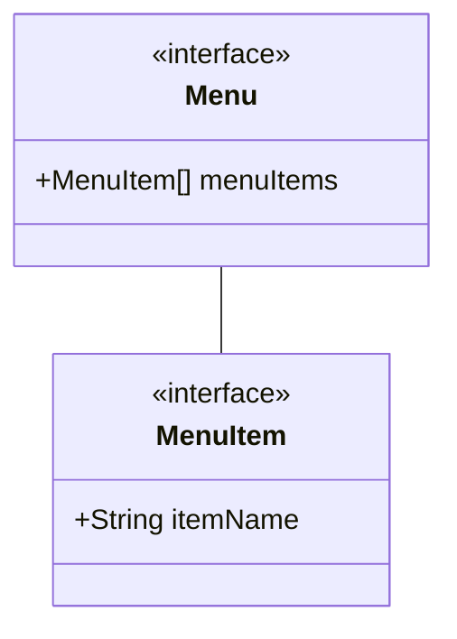

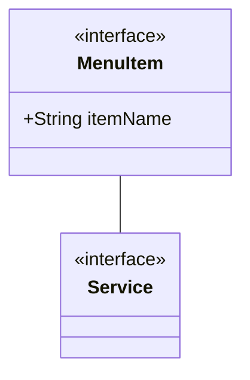

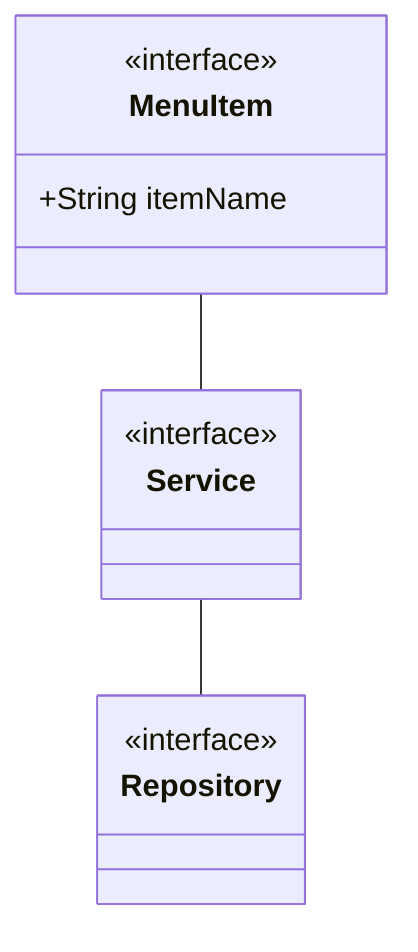

</MermaidViewer>
</LayoutColumn>
<LayoutColumn>
<div
  style={{
    display: "flex",
    flex: 1,
    width: "100%",
    flexDirection:"column"
  }}
>
<CodeViewer>

```java 616:635 file=../src/main/java/com/netcompany/Main.java showNumbers zoomIn=1.5

```

```java 481:509 file=../src/main/java/com/netcompany/Main.java showNumbers zoomIn=1.1

```

```java 636:642 file=../src/main/java/com/netcompany/Main.java showNumbers zoomIn=1.5

```

</CodeViewer>
</div>
</LayoutColumn>
</WhiteColumnLayout>

---

<WhiteColumnLayout title={"The case study"} sizes={[3,4]} colors={['#fff','#0f2147']} texts={['#0f2147','#fff']}>
<LayoutColumn>

### Abstraction - The foundation of the OOP

- <ins>Hide the complex</ins> behide the <ins>Abstraction</ins>

<MermaidViewer>

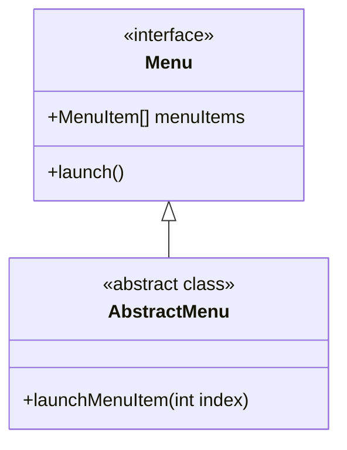

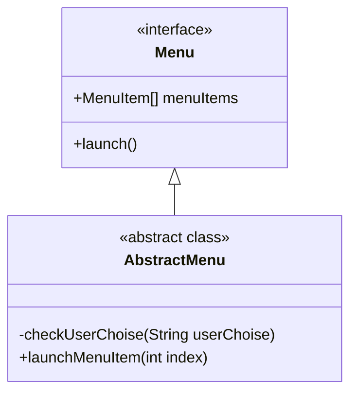

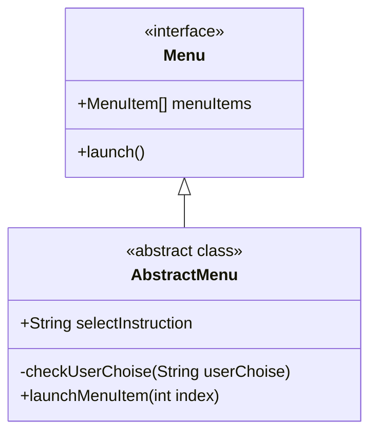

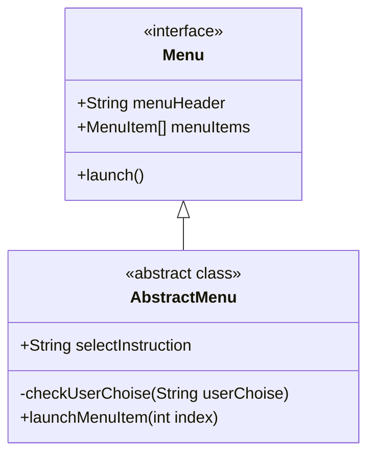

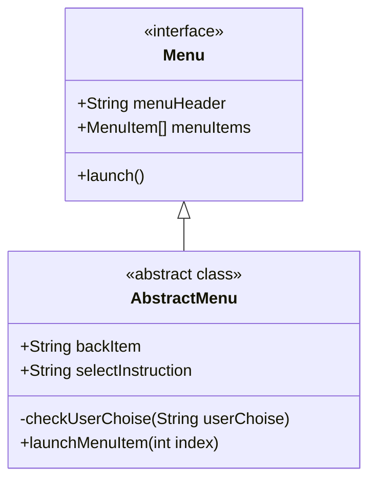

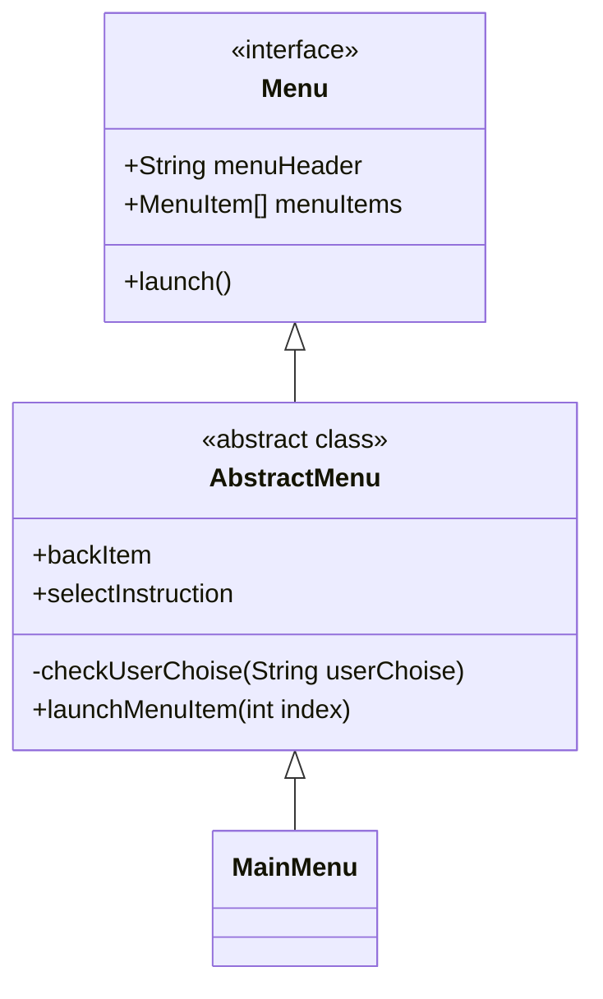

</MermaidViewer>
</LayoutColumn>
<LayoutColumn>
<div
  style={{
    display: "flex",
    flex: 1,
    width: "100%"
  }}
>
<CodeViewer>

```java 805:808 file=../src/main/java/com/netcompany/Main.java showNumbers zoomIn=1.5

```

```java 287:288 file=../src/main/java/com/netcompany/Main.java showNumbers zoomIn=1.5

```

```java 285 file=../src/main/java/com/netcompany/Main.java showNumbers zoomIn=2

```

```java 802:803 file=../src/main/java/com/netcompany/Main.java showNumbers zoomIn=1.6

```

```java 279:283 file=../src/main/java/com/netcompany/Main.java showNumbers zoomIn=1.9

```

```java 10:30 file=../src/main/java/com/netcompany/menu/MainMenu.java zoomIn=1.5

```

</CodeViewer>
</div>
</LayoutColumn>
</WhiteColumnLayout>

---

<WhiteColumnLayout title={"The case study"} sizes={[3,4]} colors={['#fff','#0f2147']} texts={['#0f2147','#fff']}>
<LayoutColumn>

### Abstraction - The foundation of the OOP

- Focus on <ins>high-level idea</ins>, seperately from the <ins>low-level details</ins>

<MermaidViewer>

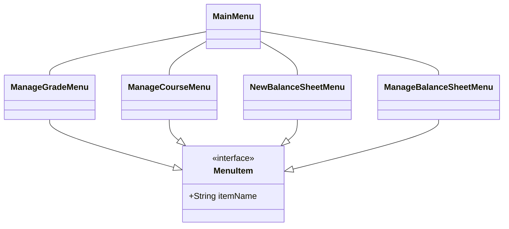

</MermaidViewer>
</LayoutColumn>
<LayoutColumn>
<div
  style={{
    display: "flex",
    flex: 1,
    width: "100%"
  }}
>
<CodeViewer>

```java 801:824 file=../src/main/java/com/netcompany/Main.java showNumbers zoomIn=1.3

```

</CodeViewer>
</div>
</LayoutColumn>
</WhiteColumnLayout>

---

<WhiteLayout title={"The case study"}>

### Abstraction - The foundation of the OOP

- Focus on <ins>high-level idea</ins>, seperately from the <ins>low-level details</ins>

<MermaidViewer>

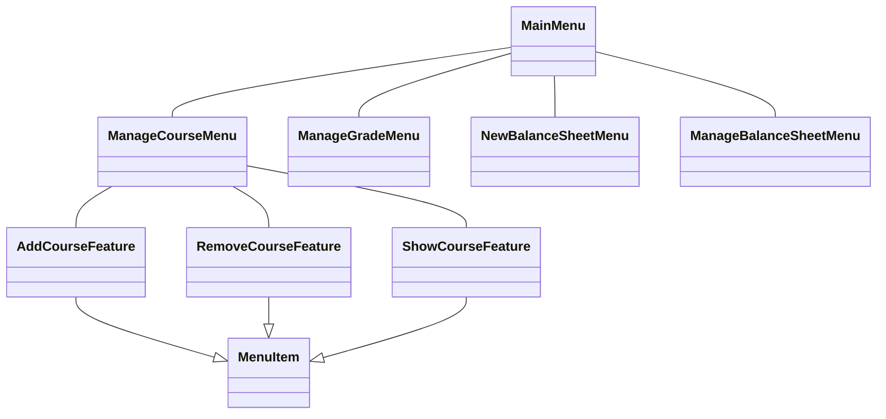

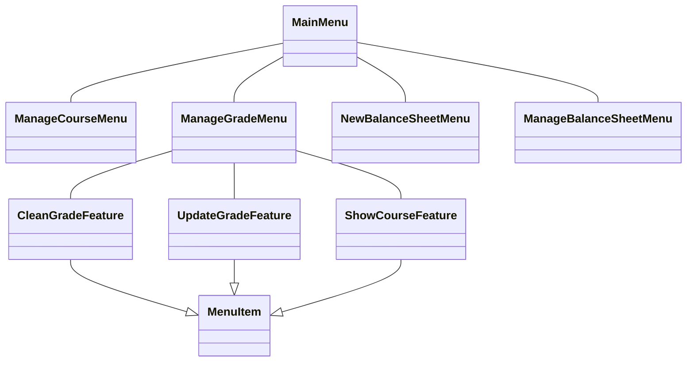

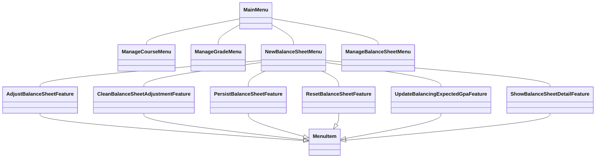

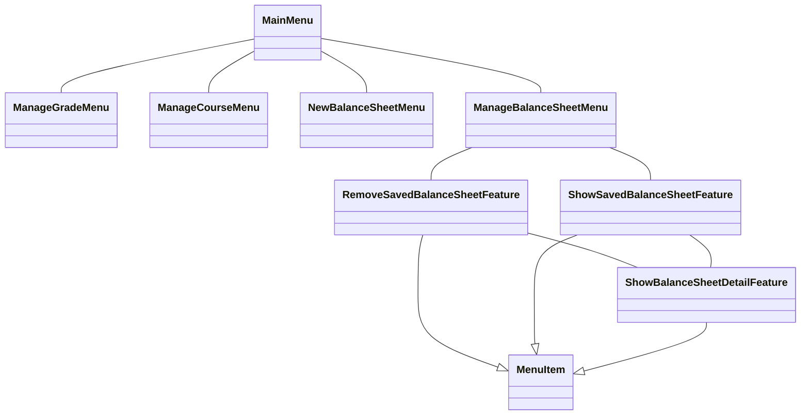

</MermaidViewer>
</WhiteLayout>

---

<WhiteLayout title={"The case study"}>
### Abstraction - The foundation of the OOP

- Focus on <ins>high-level idea</ins>, seperately from the <ins>low-level details</ins>

<MermaidViewer>

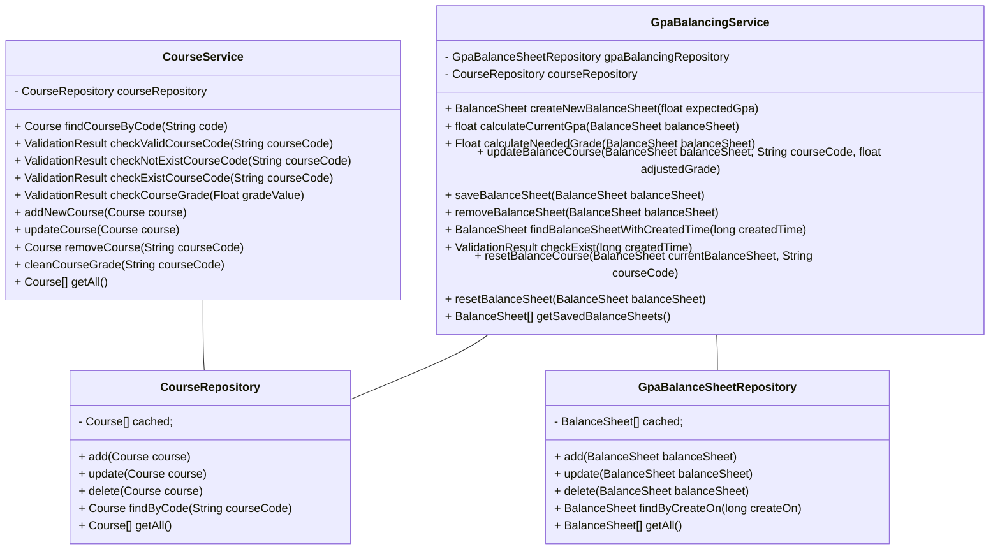

</MermaidViewer>
</WhiteLayout>

---

<WhiteColumnLayout title={"The case study"} sizes={[4,3]}>
<LayoutColumn>

### Abstraction - The foundation of the OOP

- Seperate <ins>WHAT</ins> from <ins>HOW</ins>

- <ins>Hide the complex</ins> behide the <ins>Abstraction</ins>

- Focus on <ins>high-level idea</ins>, seperately from the <ins>low-level details</ins>

</LayoutColumn>
<LayoutColumn>
<MermaidViewer>

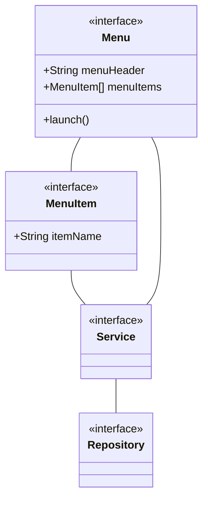

</MermaidViewer>
</LayoutColumn>
</WhiteColumnLayout>

---

<WhiteLayout title={"The case study"}>

### Abstraction

> It's not just about the domain objects

<MermaidViewer>

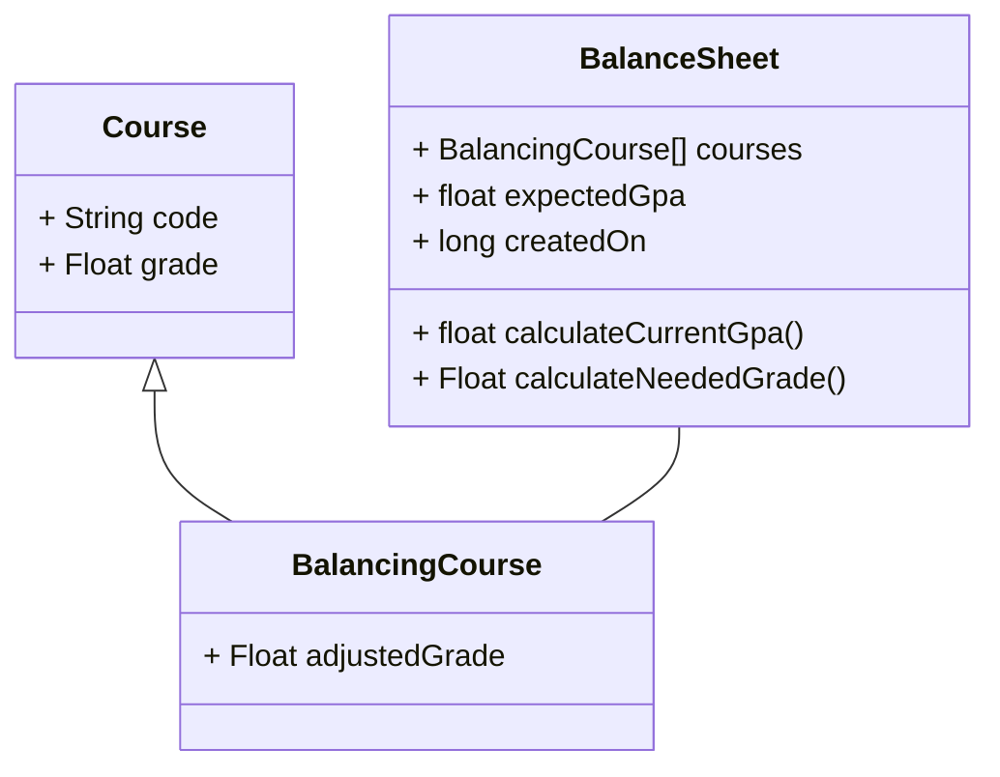

</MermaidViewer>
</WhiteLayout>
