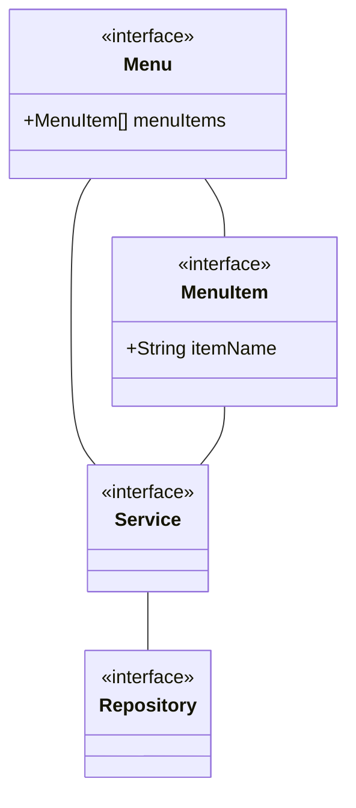
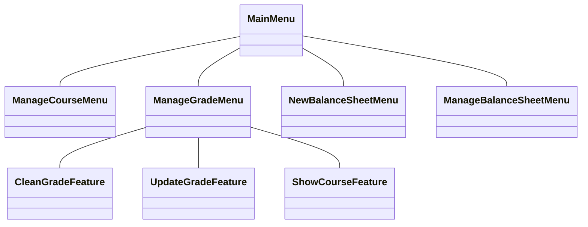

import {
  CodeLayout,
  CodeViewer,
  MermaidViewer,
  CodeDescription,
  WhiteColumnLayout,
  LayoutColumn,
  WhiteLayout,
} from "netcompany-mdx-slide";

import code_structure from "./assets/code_structure.png";
import loc_analysis from "./assets/loc_analysis.png";

<WhiteColumnLayout title={"The case study"} sizes={[3,4]} colors={['#fff','#0f2147']} texts={['#0f2147','#fff']}>
<LayoutColumn>

### Conclusion

- Well-organized project

- Easier to locate the issue

</LayoutColumn>
<LayoutColumn>
<div
  style={{
    objectFit: 'contain',
    overflow: "hidden",
    display: "flex",
    flexDirection: "row",
    flex: "1",
  }}
>
  
</div>
</LayoutColumn>
</WhiteColumnLayout>

---

<WhiteColumnLayout title={"The case study"} sizes={[3,4]} colors={['#fff','#0f2147']} texts={['#0f2147','#fff']}>
<LayoutColumn>

### Conclusion

- Well-organized project

- Easier to locate the issue

- Easier to comprehend and start coding

</LayoutColumn>
<LayoutColumn>
<div
  style={{
    display: "flex",
    flex: 1,
    width: "100%",
    flexDirection:"column"
  }}
>
<CodeViewer>

```java 5:13 file=../src/main/java/com/netcompany/core/Menu.java

```

```java 3:7 file=../src/main/java/com/netcompany/core/MenuItem.java

```

```java 9:31 file=../src/main/java/com/netcompany/service/CourseService.java

```

</CodeViewer>
</div>
</LayoutColumn>
</WhiteColumnLayout>

---

<WhiteColumnLayout title={"The case study"} sizes={[3,4]} colors={['#fff','#0f2147']} texts={['#0f2147','#fff']}>
<LayoutColumn>

### Conclusion

- Well-organized project

- Easier to locate the issue

- Easier to comprehend and start coding

- Easier to find and re-use a logic

</LayoutColumn>
<LayoutColumn>
<div
  style={{
    display: "flex",
    flex: 1,
    width: "100%",
    flexDirection:"column"
  }}
>
<CodeViewer>

```java 8:46 file=../src/main/java/com/netcompany/core/AbstractMenu.java showNumbers zoomIn=1.3

```

```java 8:31 file=../src/main/java/com/netcompany/menu/manageGrade/ManageGradeMenu.java zoomIn=1.5

```

```java 6:29 file=../src/main/java/com/netcompany/utils/StringUtils.java zoomIn=1.5

```

</CodeViewer>
</div>
</LayoutColumn>
</WhiteColumnLayout>

---

<WhiteColumnLayout title={"The case study"} sizes={[3,4]}>
<LayoutColumn>

### Conclusion

- Well-organized project

- Easier to locate the issue

- Easier to comprehend and start coding

- Easier to find and re-use a logic

- Loosing the coupling and increase cohesion

</LayoutColumn>
<LayoutColumn>

<MermaidViewer>





</MermaidViewer>
</LayoutColumn>
</WhiteColumnLayout>

---

<WhiteColumnLayout title={"The case study"} sizes={[3,4]}>
<LayoutColumn>

### Conclusion

- Well-organized project

- Easier to locate the issue

- Easier to find and re-use a logic

- Loosing the coupling and increase cohesion

- Increase the complexity

</LayoutColumn>
<LayoutColumn>
<div
  style={{
    objectFit: 'contain',
    overflow: "hidden",
    display: "flex",
    flexDirection: "row",
    flex: "1",
  }}
>
  
</div>
</LayoutColumn>
</WhiteColumnLayout>
