import {
  IntroductionLayout,
  CodeLayout,
  CodeViewer,
  MermaidViewer,
  CodeDescription,
  WhiteColumnLayout,
  WhiteLayout,
  Image,
  SectionHeadLayout,
  ListerSteps,
  SwitcherSteps,
  netcompanyTheme,
} from "netcompany-mdx-slide";
import { Head, Steps } from "mdx-deck";
import "prismjs/components/prism-java";

import nlntImage from "./assets/nlnt.jpg";
import pctImage from "./assets/pct.jpg";
import netcompanyMap from "./assets/netcompany-map-2.png";
import netcompanyIndex from "./assets/netcompany-index.png";
import netcompanyService from "./assets/netcompany-service.png";
import programmingParadigms from "./assets/programming_paradigms.png";
import Dazzle_icon from "./assets/Dazzle_icon.webp";
import Huskar_icon from "./assets/Huskar_icon.webp";
import Invoker_icon from "./assets/Invoker_icon.webp";
import redDash from "./assets/red-dash.png";
import feature1 from "./assets/feature/feature1.png";
import feature2 from "./assets/feature/feature2.png";
import feature3 from "./assets/feature/feature3.png";
import feature4 from "./assets/feature/feature4.png";
import feature5 from "./assets/feature/feature5.png";
import feature6 from "./assets/feature/feature6.png";
import feature7 from "./assets/feature/feature7.png";

export const theme = netcompanyTheme;

hello

---

<Head>
  <title>JAVA OOP ORIENTATION</title>
  <link rel="preconnect" href="https://fonts.googleapis.com" />
  <link rel="preconnect" href="https://fonts.gstatic.com" crossorigin />
  <link
    href="https://fonts.googleapis.com/css2?family=M+PLUS+Rounded+1c:wght@800;900&family=Nunito&family=Varela+Round&display=swap"
    rel="stylesheet"
  />
</Head>

<IntroductionLayout title={"JAVA OOP\nORIENTATION"} department={"CoEs"} />

---

<WhiteLayout title={"Agenda"}>

- Introduction.
- Programming paradigms.
- OOP 101.
- The case study.
- Example from real projects.
- Summary.
- Practical.

</WhiteLayout>

---

<WhiteColumnLayout title={"Introduction"} sizes={[4,3]} colors={['#fff','#0f2147']} texts={['#0f2147','#fff']}>

<LayoutColumn>

### Phan Cong Thuc

- 1.
- 2.
- 3.
- 4.

</LayoutColumn>
<LayoutColumn>


</LayoutColumn>

</WhiteColumnLayout>

---

<WhiteColumnLayout title={"Introduction"} sizes={[4,3]} colors={['#fff','#0f2147']} texts={['#0f2147','#fff']}>

<LayoutColumn>

### Nguyen Le Nhat Truong

- B.Sc in Software Engineering by FPT Uni.
- 9 years of working experience in IT industry.
- I started in Netcompany in November 2020 as a consultant:
  - Developer in a Web application project.
  - Team lead and software architect.
- Today I'm the Senior Architect for Netcompany Vietnam.

</LayoutColumn>
<LayoutColumn>


</LayoutColumn>

</WhiteColumnLayout>

---

<WhiteColumnLayout title={"Netcompany at a glance"} colors={['#fff','#0f2147']} texts={['#0f2147','#fff']}>

<LayoutColumn fontSize={"0.7em"} fontFamily={"Varela Round"}>

Netcompany is one of Europe’s fastest growing and most successful IT services companies, leading the way in showing how digital transformation can create strong, sustainable societies, successful companies and better lives for us all.

Our ambition is to become the market leader within IT services in Europe. The acquisition of Intrasoft in 2021 has strengthened our foundation to achieve that ambition – further expanding our portfolio of platforms and unique expertise across sectors with a global headcount of +6,500 talented employees.

By building flexible, scalable and secure digital platforms, Netcompany is positioned to help Europe thrive through a decade of massive digitisation.


</LayoutColumn>
<LayoutColumn>


</LayoutColumn>

</WhiteColumnLayout>

---

<WhiteLayout title={"An active end-to-end service provider"}>

<div
  style={{
    display: "flex",
    justifyContent: "center",
    alignItems: "center",
    flex: 1,
  }}
>
  
</div>

</WhiteLayout>

---

<SectionHeadLayout
  title={"Programming paradigms"}
  backgroundImage={programmingParadigms}
/>

---

<WhiteLayout title={"Programming paradigms"}>

</WhiteLayout>

---

<SectionHeadLayout title={"OOP 101"} />

---

<WhiteLayout title={"OOP 101"}>

</WhiteLayout>

---

<SectionHeadLayout title={"The case study"} />

---

<WhiteColumnLayout title={"The case study"} sizes={[4,3]} colors={['#fff','#0f2147']} texts={['#0f2147','#fff']}>

<LayoutColumn>

### Context

Greeting Dazzle the Coder

<ListerSteps>

- A junior student who have very good programming skill

- He has a cool project to manage his own GPA

- He just finished his OOP course in the last semester

</ListerSteps>

</LayoutColumn>
<LayoutColumn>

<div
  style={{
    display: "flex",
    justifyContent: "center",
    alignItems: "start",
    paddingTop: "2em",
    flex: 1,
    width: "100%",
  }}
>
  
</div>

</LayoutColumn>

</WhiteColumnLayout>

---

<WhiteColumnLayout title={"The case study"} sizes={[4,3]} colors={['#fff','#0f2147']} texts={['#0f2147','#fff']}>

<LayoutColumn>

### Context

Meet his GPA management app:

<ListerSteps showFirstItem={true}>

- A console application writen in JAVA
- Allow student manage their courses
- Allow student to input or clean grade for courses and view them
- Create a GPA balance sheet base on their current GPA and their expected
- Allow student to save manage their adjusted balance sheets
- They can view or clean a saved sheet
- A cool tool to planning for a new semester

</ListerSteps>

</LayoutColumn>
<LayoutColumn>

<div
  style={{
    display: "flex",
    justifyContent: "center",
    alignItems: "start",
    paddingTop: "2em",
    flex: 1,
    width: "100%",
  }}
>
  <SwitcherSteps>
    
    
    
    
    
    
    
  </SwitcherSteps>
</div>

</LayoutColumn>

</WhiteColumnLayout>

---

<WhiteColumnLayout title={"The case study"} sizes={[4,3]} colors={['#fff','#0f2147']} texts={['#0f2147','#fff']}>
<LayoutColumn>

### Context

Greeting Dazzle's best friend, Huskar

<ListerSteps showFirstItem={true}>

- He is Dazzle's bestie

- He has a huge passion with programming

- His programming skill is not as good as Dazzle

- He is a loyal user of Dazzle's App

- He shared a lot of ideas about this App and wants to help Dazzle to build up this App

</ListerSteps>
</LayoutColumn>
<LayoutColumn>
<div
  style={{
    display: "flex",
    justifyContent: "start",
    alignItems: "center",
    paddingTop: "2em",
    flex: 1,
    width: "100%",
    flexDirection:"column"
  }}
>
  
  
</div>
</LayoutColumn>
</WhiteColumnLayout>

---

<WhiteLayout title={"The case study"}>

### Context

#### In the very first day, they facing some collaboration problems

- It's take Dazzle a while to onboard Huskar to the project

</WhiteLayout>

---

<CodeLayout title={"The case study"} subTitle={"Context"}>

```java 586:614 file=../src/main/java/com/netcompany/Main.java showNumbers

```

```java 616:644 file=../src/main/java/com/netcompany/Main.java showNumbers

```

```java 665:722 file=../src/main/java/com/netcompany/Main.java showNumbers

```

```java 724:746 file=../src/main/java/com/netcompany/Main.java showNumbers

```

```java 795:827 file=../src/main/java/com/netcompany/Main.java showNumbers

```

</CodeLayout>

---

<WhiteLayout title={"The case study"}>

### Context

#### In the very first day, they facing some collaboration problems

- It's take Dazzle a while to onboard Huskar to the project

<ListerSteps showFirstItem={true}>

- There is major file conflict for every new feature they develop together

- Duplicated code everywhere

- **Take time to develop features concurrently**

</ListerSteps>

</WhiteLayout>

---

<WhiteColumnLayout title={"The case study"} sizes={[4,3]} colors={['#fff','#0f2147']} texts={['#0f2147','#fff']}>
<LayoutColumn>

### Context

Dazzle and Huskar try to get help from a senior student, Invoker. He's give them some advises:

- Re-organize their code so the human can read easyly.

- Using OOP as a fundamental tool to refactor their project.

- Conduct a human friendly code structure and arrange classes into it.

**_Let follow their journey to build-up a maintainable project._**

</LayoutColumn>
<LayoutColumn>
<div
  style={{
    display: "flex",
    justifyContent: "start",
    alignItems: "center",
    paddingTop: "2em",
    flex: 1,
    width: "100%",
    flexDirection:"column"
  }}
>
  
  
  
</div>
</LayoutColumn>
</WhiteColumnLayout>

---

<WhiteLayout title={"The case study"}>

### Abstraction - The foundation of the OOP

- Seperate <ins>WHAT</ins> from <ins>HOW</ins>

- <ins>Hide the complex</ins> behide the <ins>Abstraction</ins>

- Focus on <ins>high-level idea</ins>, seperately from the <ins>low-level details</ins>

</WhiteLayout>

---

<WhiteColumnLayout title={"The case study"} sizes={[3,4]} colors={['#fff','#0f2147']} texts={['#0f2147','#fff']}>
<LayoutColumn>

### Abstraction - The foundation of the OOP

- Seperate <ins>WHAT</ins> from <ins>HOW</ins>

<MermaidViewer>

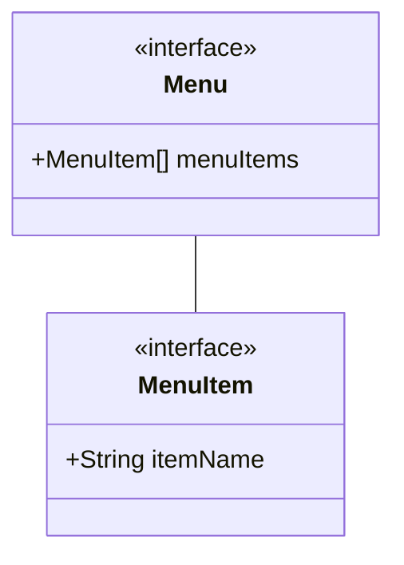

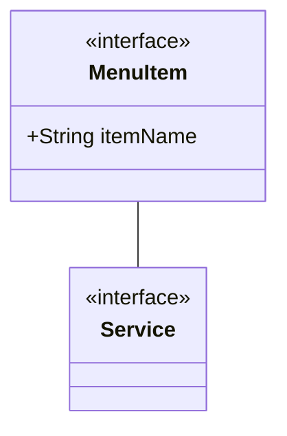

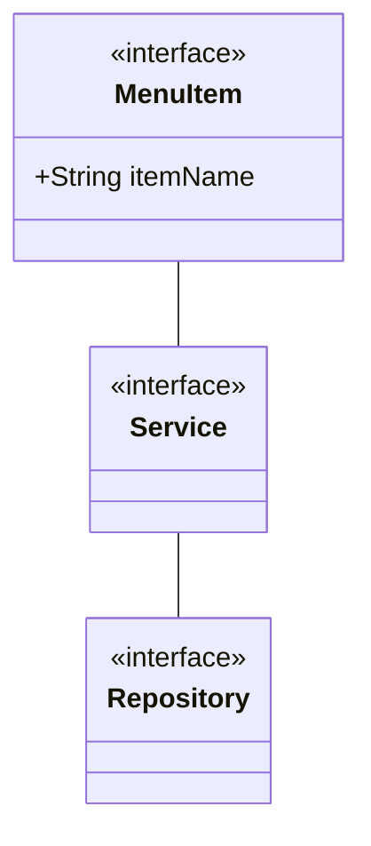

</MermaidViewer>
</LayoutColumn>
<LayoutColumn>
<div
  style={{
    display: "flex",
    flex: 1,
    width: "100%",
    flexDirection:"column"
  }}
>
<CodeViewer>

```java 616:635 file=../src/main/java/com/netcompany/Main.java showNumbers zoomIn=1.5

```

```java 481:509 file=../src/main/java/com/netcompany/Main.java showNumbers zoomIn=1.1

```

```java 636:642 file=../src/main/java/com/netcompany/Main.java showNumbers zoomIn=1.5

```

</CodeViewer>
</div>
</LayoutColumn>
</WhiteColumnLayout>

---

<WhiteColumnLayout title={"The case study"} sizes={[3,4]} colors={['#fff','#0f2147']} texts={['#0f2147','#fff']}>
<LayoutColumn>

### Abstraction - The foundation of the OOP

- <ins>Hide the complex</ins> behide the <ins>Abstraction</ins>

<MermaidViewer>

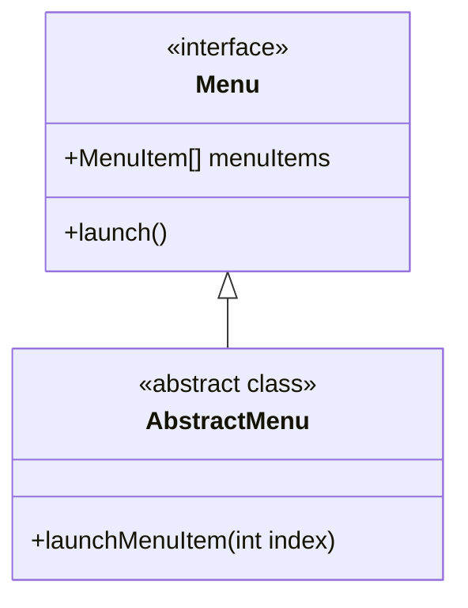

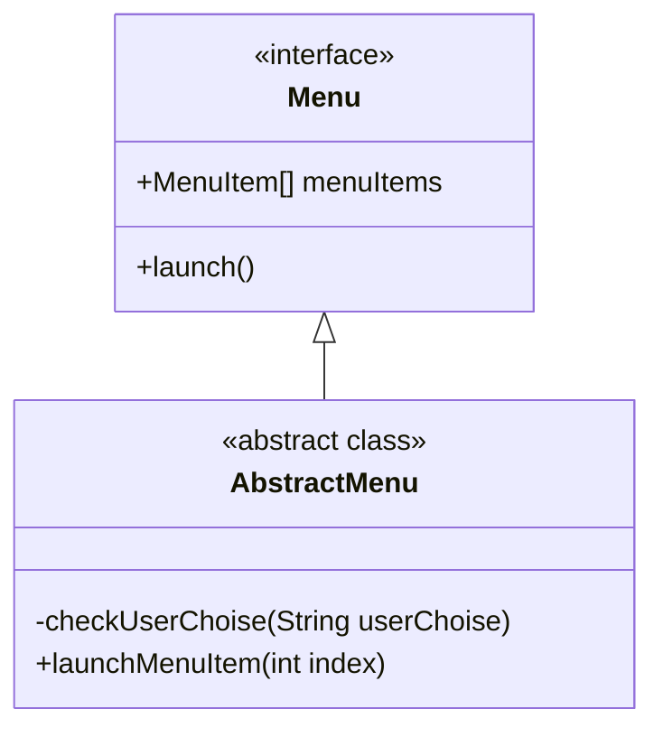

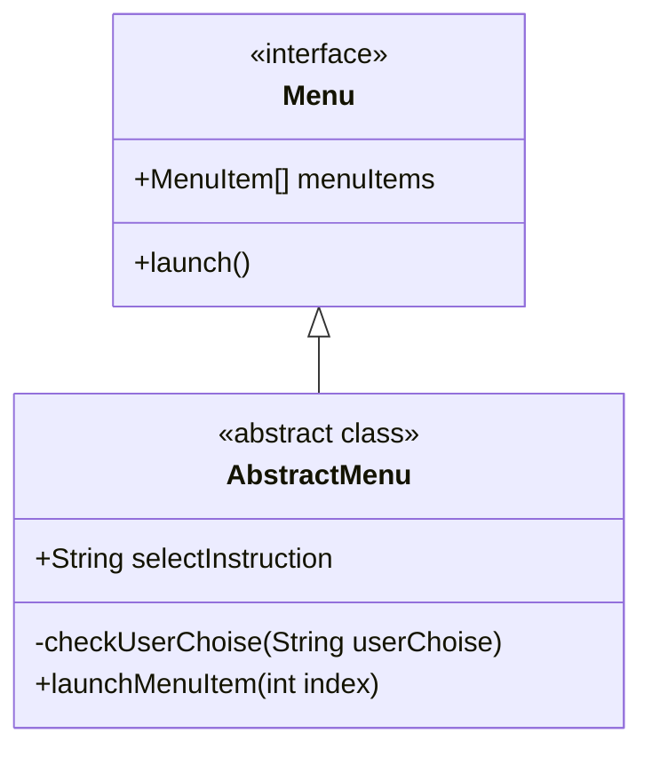

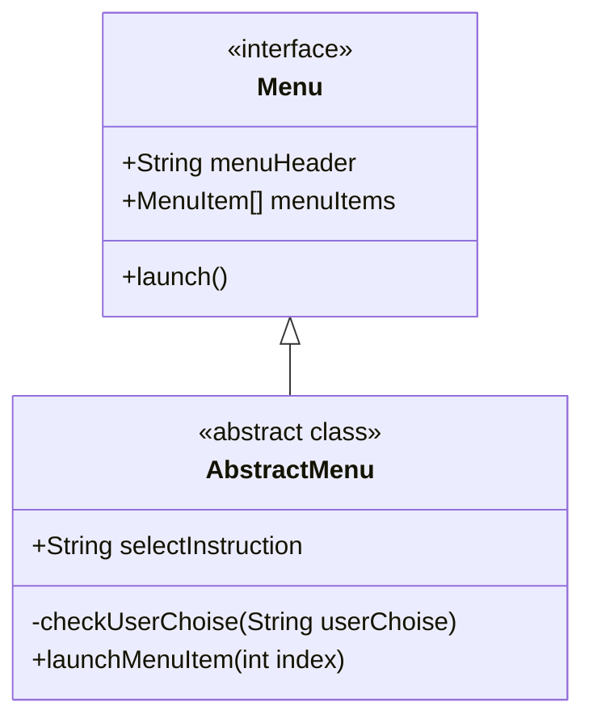

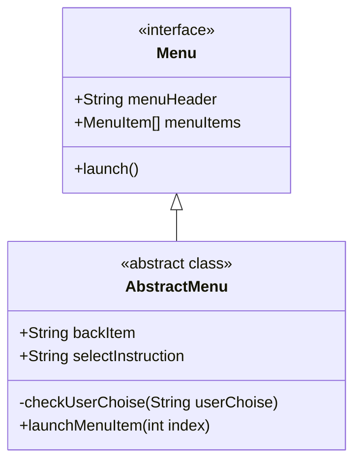

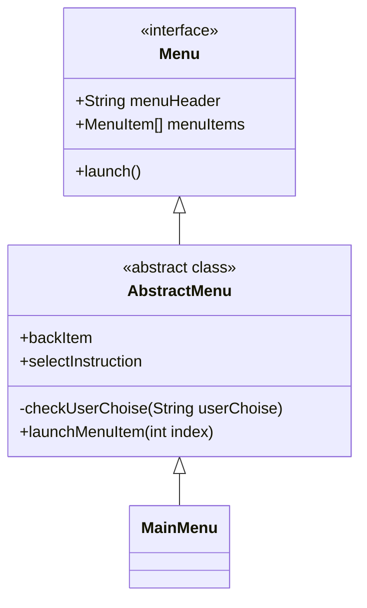

</MermaidViewer>
</LayoutColumn>
<LayoutColumn>
<div
  style={{
    display: "flex",
    flex: 1,
    width: "100%"
  }}
>
<CodeViewer>

```java 805:808 file=../src/main/java/com/netcompany/Main.java showNumbers zoomIn=1.5

```

```java 287:288 file=../src/main/java/com/netcompany/Main.java showNumbers zoomIn=1.5

```

```java 285 file=../src/main/java/com/netcompany/Main.java showNumbers zoomIn=2

```

```java 802:803 file=../src/main/java/com/netcompany/Main.java showNumbers zoomIn=1.6

```

```java 279:283 file=../src/main/java/com/netcompany/Main.java showNumbers zoomIn=1.9

```

```java 10:30 file=../src/main/java/com/netcompany/menu/MainMenu.java zoomIn=1.5

```

</CodeViewer>
</div>
</LayoutColumn>
</WhiteColumnLayout>

---

<WhiteColumnLayout title={"The case study"} sizes={[3,4]} colors={['#fff','#0f2147']} texts={['#0f2147','#fff']}>
<LayoutColumn>

### Abstraction - The foundation of the OOP

- Focus on <ins>high-level idea</ins>, seperately from the <ins>low-level details</ins>

<MermaidViewer>

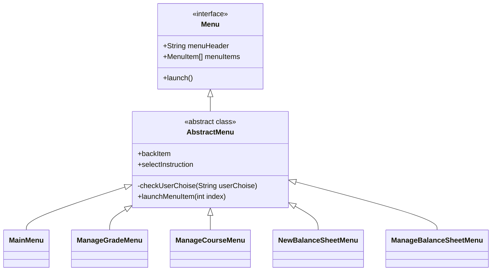

</MermaidViewer>
</LayoutColumn>
<LayoutColumn>
<div
  style={{
    display: "flex",
    flex: 1,
    width: "100%"
  }}
>
<CodeViewer>

```java 801:824 file=../src/main/java/com/netcompany/Main.java showNumbers zoomIn=1.3

```

</CodeViewer>
</div>
</LayoutColumn>
</WhiteColumnLayout>

---

<WhiteColumnLayout title={"The case study"} sizes={[3,4]} colors={['#fff','#0f2147']} texts={['#0f2147','#fff']}>
<LayoutColumn>

### Abstraction - The foundation of the OOP

- Focus on <ins>high-level idea</ins>, seperately from the <ins>low-level details</ins>

<MermaidViewer>

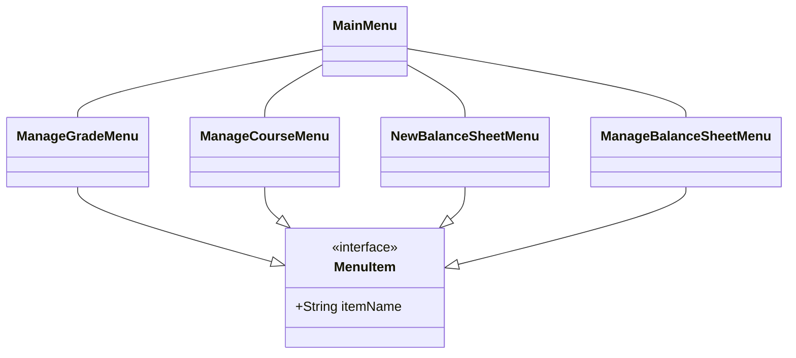

</MermaidViewer>
</LayoutColumn>
<LayoutColumn>
<div
  style={{
    display: "flex",
    flex: 1,
    width: "100%"
  }}
>
<CodeViewer>

```java 801:824 file=../src/main/java/com/netcompany/Main.java showNumbers zoomIn=1.3

```

</CodeViewer>
</div>
</LayoutColumn>
</WhiteColumnLayout>

---

<WhiteLayout title={"The case study"}>
### Abstraction - The foundation of the OOP

- Focus on <ins>high-level idea</ins>, seperately from the <ins>low-level details</ins>

<MermaidViewer>

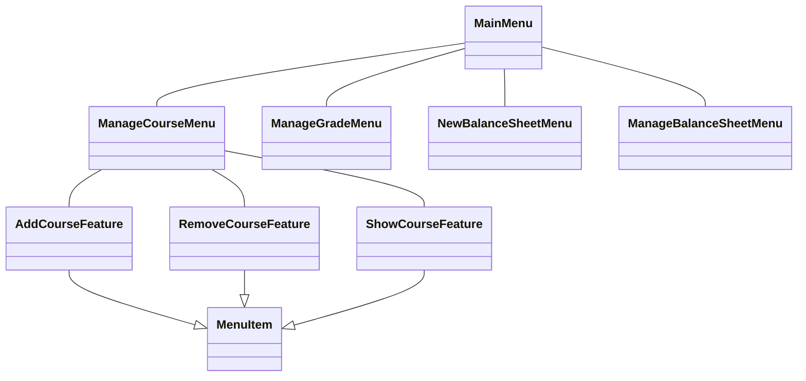

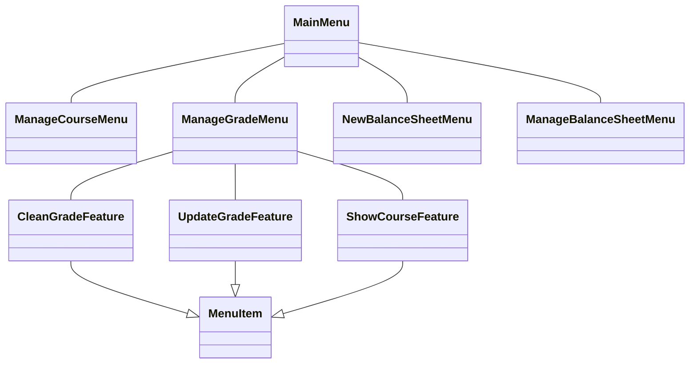

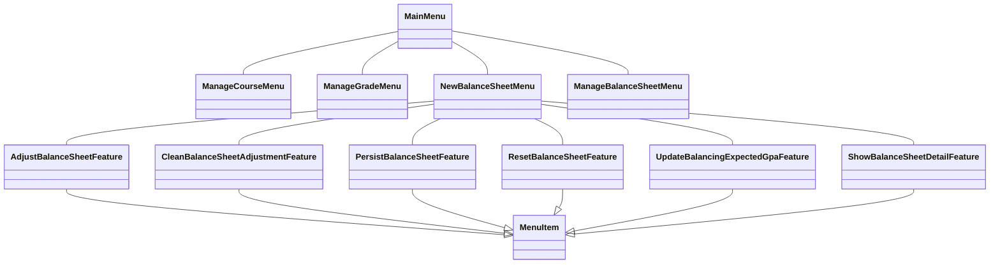

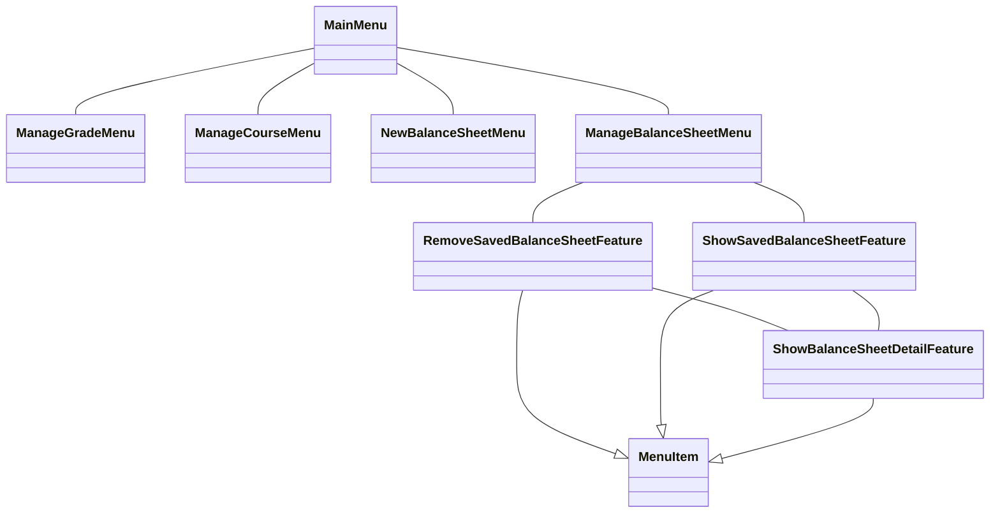

</MermaidViewer>
</WhiteLayout>

---

<WhiteLayout title={"The case study"}>
### Abstraction - The foundation of the OOP

- Focus on <ins>high-level idea</ins>, seperately from the <ins>low-level details</ins>

<MermaidViewer>

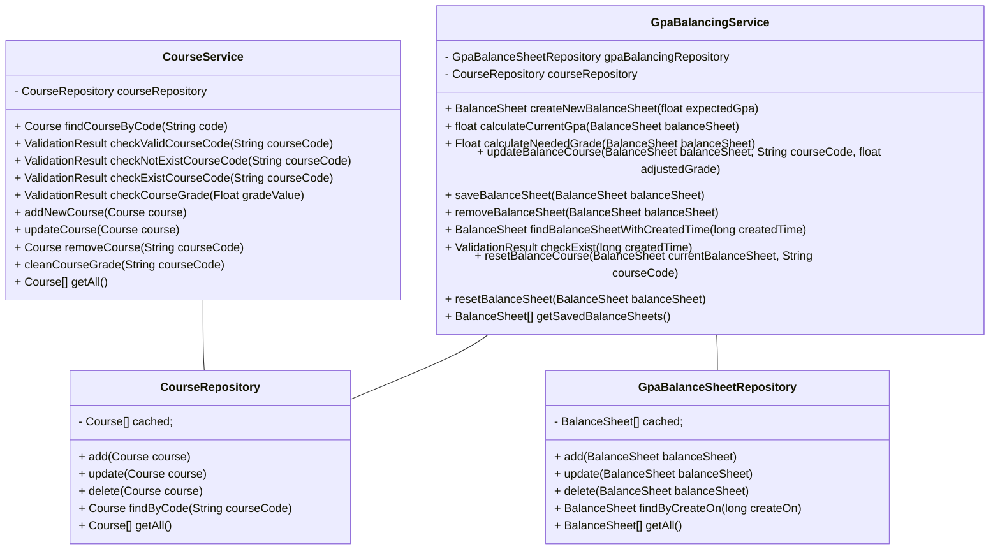

</MermaidViewer>
</WhiteLayout>

---

<WhiteColumnLayout title={"The case study"} sizes={[4,3]}>
<LayoutColumn>

### Abstraction - The foundation of the OOP

- Seperate <ins>WHAT</ins> from <ins>HOW</ins>

- <ins>Hide the complex</ins> behide the <ins>Abstraction</ins>

- Focus on <ins>high-level idea</ins>, seperately from the <ins>low-level details</ins>

</LayoutColumn>
<LayoutColumn>
<MermaidViewer>

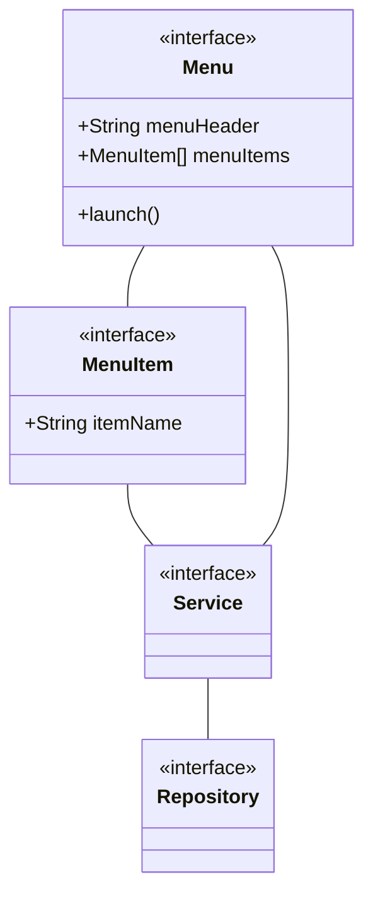

</MermaidViewer>
</LayoutColumn>
</WhiteColumnLayout>

---

<WhiteLayout title={"The case study"}>

### Abstraction - It's not just the domain objects

<MermaidViewer>

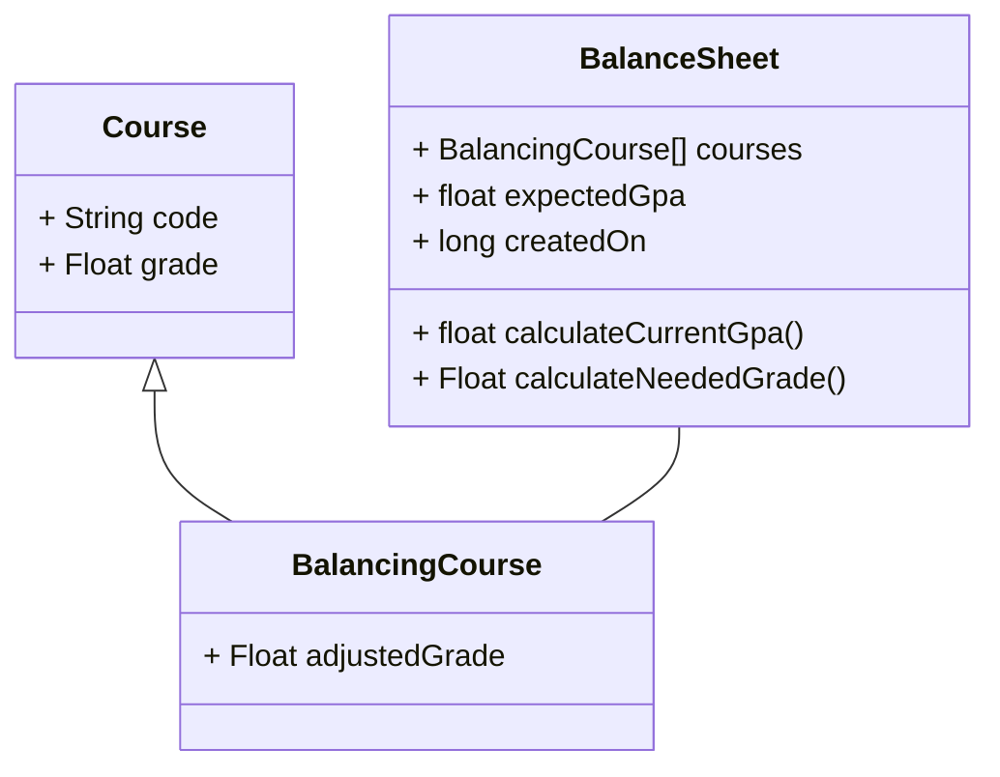

</MermaidViewer>
</WhiteLayout>

---

<WhiteLayout title={"The case study"}>

### Encapsulation - The state management for the Objects

-

</WhiteLayout>

---

<SectionHeadLayout title={"Example from real projects"} />

---

<WhiteLayout title={"Example from real projects"}>

</WhiteLayout>

---

<SectionHeadLayout title={"Summary"} />

---

<WhiteLayout title={"Summary"}>

</WhiteLayout>

---

<SectionHeadLayout title={"Practical"} />

---

<WhiteLayout title={"Practical"}>

## Opal tower Parking Management System

**Business:** OPAL Tower is a modern building which has 41 floors and 4 basements, including high-class apartments, offices and convenient and modern shop-houses.
The owner of building want to have a nice parking management application.

The building has 4 basements, the first 3 basements are preserved for residences and the last one are mixed for both residences, employees and visitors.
Each basement has 100 parking slots for cars and a separated area for motorbikes.
There is a LED panel at the entry displaying how many slots (for car) available at the moment.

For residences and employees, they have to register their vehicles beforehand by providing owner's information, vehicle info. These info will be stored in a small card used for check-in/check-out. User must present this card for check-in/out.
For visitor, card will be provided when check-in and returned to parking attendant when check out
Parking fee for residences and employees is a fix amount and charged monthly. For visitors, the fee is calculated by block rate and be payed at check-out by cash.

- For motorbike: 4k for first block 4 hours, 1k for each next hour.
- For car: 40k for first 4 hours, 20k for each next hour.

</WhiteLayout>

---

<WhiteLayout title={"Practical"}>

## Opal tower Parking Management System

### Requirements

Use object-oriented programming to build a simple parking management application.

- Identify the customers, vehicles that application supports.
- Identify objects, their properties and methods name.
- Describe relationship of objects, object hierarchy.
- Describe detail of check-in and check-out flow/steps.

</WhiteLayout>
